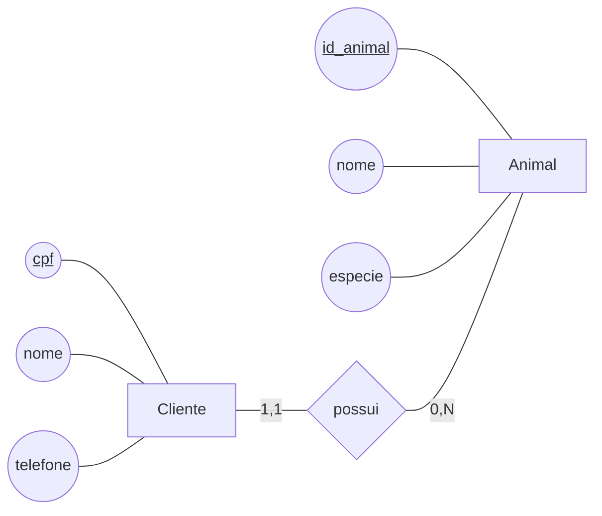
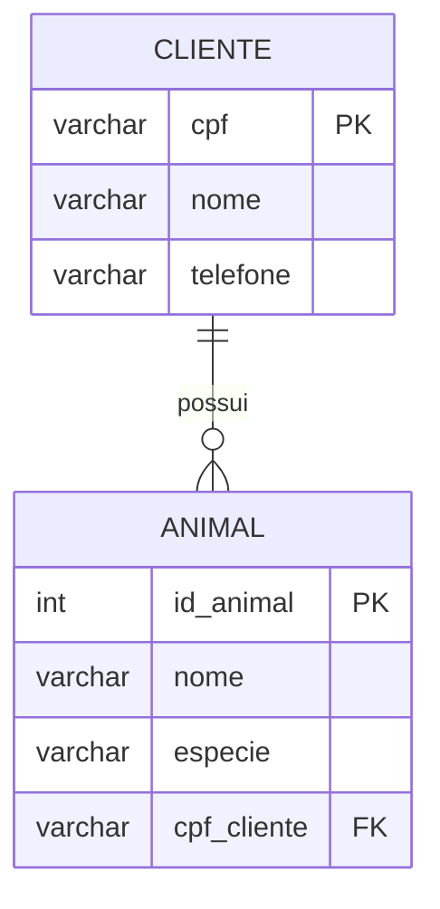

# Aula 1 - Criando nosso primeiro Banco

Nesta aula vamos criar nosso primeiro banco de dados. Vamos começar criando um modelo conceitual a partir de uma descrição de domínio. Depois vamos criar nosso modelo lógico a partir do conceitual. Por fim vamos implementar nosso banco e navegar pelas tabelas.

## Modelo Conceitual

Modelagem conceitual é a etapa de representação dos conceitos relevantes de um domínio e das relações entre eles. Seu foco está em compreender e organizar o significado dos dados, sem depender dos detalhes de implementação de um banco de dados específico, como tabelas, tipos de dados, índices ou comandos SQL.

A comunidade de banco de dados tradicionalmente utiliza o Modelo Entidade-Relacionamento (MER) para realizar a modelagem conceitual. Os conceitos centrais do MER são entidades, atributos e relacionamentos.

- **Entidades:** mapeiam categorias ou tipos de objetos que existem no domínio. Podem representar objetos físicos, como livros, carros e computadores; seres, como pessoas e animais; instituições, como escolas, empresas e hospitais; papéis exercidos em um contexto, como cliente, veterinário, aluno e professor; eventos, como aulas, consultas e vendas; conceitos abstratos, como obra literária, filme, contrato e folha de pagamento; dentre outros conceitos.
- **Atributos:** são as características ou propriedades das entidades. Uma entidade `Cliente` pode ter os atributos `nome`, `telefone`, `data de nascimento` e `endereço`; uma entidade `Livro` pode ter `título`, `ano de publicação` e `ISBN`; e uma entidade `Consulta` pode ter `data`, `horário` e `observação`.
- **Atributos identificadores:** são atributos que identificam uma instância de uma entidade. Não pode haver duas instâncias de uma entidade com o mesmo valor para esse atributo. No exemplo, `cpf` identifica cada cliente e `id_animal` identifica cada animal.
- **Relacionamentos:** representam as associações ou vínculos entre entidades. Exemplos são `Cliente possui Animal`, `Aluno frequenta Turma`, `Professor ministra Aula`, `Médico realiza Consulta` e `Carro pertence a Pessoa`.
- **Cardinalidades:** cada extremidade do relacionamento tem uma cardinalidade mínima e uma cardinalidade máxima. A cardinalidade mínima é, tipicamente, 0 ou 1, indicando se a participação é opcional ou obrigatória. A cardinalidade máxima é, tipicamente, 1 ou N, indicando quantas instâncias podem participar do relacionamento (N indica que não há limite máximo). Os relacionamentos podem ser categorizados considerando as cardinalidades máximas, como: "1 para 1", "1 para N" ou "N para N".

Para ilustrar os conceitos, considere um domínio de clínica veterinária em que é necessário manter um arquivo dos clientes e de seus animais. O diagrama abaixo captura parte deste domínio, seguindo a notação do BRModelo, com entidades, atributos e cardinalidades:

É importante observar a ordem de leitura de um relacionamento no diagrama. Neste exemplo, lemos que um `Cliente` possui zero ou muitos `Animais`, enquanto cada `Animal` pertence a exatamente um `Cliente`. A leitura deve sempre considerar a entidade de origem, o relacionamento e a entidade de destino, respeitando as cardinalidades indicadas em cada extremidade. Note que o relacionamento deste exemplo é classificado como um relacionamento "1 para N"

### Prática de Modelo Conceitual

Para praticar os conceitos vistos até aqui, vamos utilizar a ferramenta BRModelo Offline para criar um modelo conceitual. Para isso faça download da ferramenta e faça as atividades descritas em [atividadeMER1.md](AtividadesModeloConceitual/atividadeMER1.md).

## Modelo Lógico

No nível lógico, usamos o modelo relacional, em que tudo é representado como tabelas e colunas. O modelo lógico é derivado diretamente do modelo conceitual:

- Entidades dão origem a tabelas.
- Atributos dão origem a colunas das tabelas.
- Atributos identificadores dão origem às chaves primárias.
- Relacionamentos também devem ser mapeados.
- Nesta aula, trabalharemos apenas com relacionamentos 1:N.
- Em um relacionamento 1:N, a chave primária da tabela do lado 1 é exportada para a tabela do lado N, originando a chave estrangeira.
- A chave estrangeira identifica, em uma tabela, uma linha de outra tabela relacionada.
- Além disso, criamos a restrição de integridade referencial para evitar inconsistência entre chaves primárias e estrangeiras.

Nesse exemplo, a tabela Cliente possui a chave primária `cpf`, enquanto a tabela Animal possui a chave primária `id_animal` e a chave estrangeira `cpf_cliente`, que referencia o cliente ao qual o animal pertence.

### Discussão: inconsistência que a integridade referencial evita

Um exemplo simples é tentar inserir um animal com `cpf_cliente = '999.999.999-99'` na tabela `Animal` quando não existe nenhum cliente com esse CPF na tabela `Cliente`. Nesse caso, o animal estaria apontando para um cliente que não existe, o que geraria inconsistência de dados. Outro exemplo aconteceria se o cliente com `cpf = '111.222.333-44'` fosse excluído da tabela `Cliente`, mas o animal de `id_animal = 25` ainda tivesse `cpf_cliente = '111.222.333-44'` na tabela `Animal`. Nesse cenário, o animal ficaria referenciando um cliente que não existe mais.

A restrição de integridade referencial impede esses problemas: ela garante que, para cada valor de `Animal.cpf_cliente`, exista um registro correspondente em `Cliente.cpf`. Assim, o banco não aceita que um animal seja inserido ou permaneça referenciando um cliente inexistente, preservando a consistência dos dados.

### Discussão: definição de chave primária

As chaves primárias identificam unicamente cada linha de uma tabela. Em um modelo conceitual, nem sempre a entidade possui um atributo identificador já definido no domínio. Quando isso acontece, precisamos criar um atributo identificador no nível lógico para que a tabela tenha uma chave primária.

Por exemplo, em uma entidade `Cliente`, pode não existir um atributo que seja naturalmente adequado para identificar cada cliente no modelo conceitual. Nesse caso, no nível lógico precisamos criar um identificador artificial, como `id_cliente`, para garantir unicidade.

Além disso, é uma boa prática evitar usar atributos de domínio como chave primária, como o CPF, quando a regra de negócio puder mudar. Se o CPF deixar de ser usado ou a sua formação mudar, por exemplo, de 11 dígitos para um formato diferente ou com máscara diferente, isso exigiria alterações na tabela `Cliente` e também em todas as tabelas que armazenam esse valor como chave estrangeira, como `Animal`, `Pedido`, `Pagamento` e outras.

Essa mudança teria impacto muito maior do que usar uma chave artificial, porque a chave artificial pode permanecer estável mesmo que o domínio mude. Assim, embora o CPF seja um identificador natural do cliente, em muitos projetos é preferível criar uma chave primária artificial para reduzir o impacto de alterações no domínio e preservar a estabilidade do banco de dados.

### Prática de Modelo Lógico

Para praticar os conceitos de modelo lógico vistos nesta aula, siga as instruções de [AtividadeModeloLogico1.md](AtividadesModeloLogico/AtividadeModeloLogico1.md).

## Modelo Físico

No nível físico, começamos a pensar no banco como um sistema concreto, em termos de um script SQL e de um esquema implementado em um SGBD. O objetivo desta fase é transformar o modelo lógico em instruções concretas para o SGBD, de forma que o banco possa ser criado e utilizado de fato. 

O modelo físico será representado em forma de script SQL, mais especificamente o SQL-DDL. DDL significa Data Definition Language, ou linguagem de definição de dados. O SQL-DDL é usado para criar os objetos do banco, como tabelas, colunas, tipos e restrições.

Para criar nosso banco precisamos de um Sistema Gerenciador de Banco de Dados (SGBD). Um SGBD é o software responsável por criar, armazenar, organizar, consultar e controlar o acesso aos dados de um banco de dados. Ele também oferece recursos para definir tabelas e restrições, executar comandos SQL, controlar transações, garantir a integridade dos dados e gerenciar o acesso de diferentes usuários e aplicações. Existem diversos SGBDs, cada um com características e recursos próprios. São exemplos o PostgreSQL, o MySQL, o MariaDB, o Oracle Database, o Microsoft SQL Server e o SQLite. Nesta disciplina, adotaremos o PostgreSQL, um SGBD relacional de código aberto, bastante utilizado em aplicações e compatível com os conceitos de modelo relacional e SQL trabalhados nesta aula.

Para que o nosso banco de dados possa ser acessado sem depender de uma instalação local, utilizaremos um servidor na nuvem para hospedá-lo. O serviço adotado será o [Aiven](https://aiven.io/), que disponibiliza uma instância do PostgreSQL para execução e acesso remoto. Assim, o SGBD fica em execução no ambiente de nuvem, enquanto nós acessamos o banco pela internet usando uma ferramenta gerenciadora.

O serviço de banco de dados permanece rodando em segundo plano, ou *background*, aguardando conexões e comandos de usuários e aplicações. Para criar, consultar e administrar o banco, utilizamos ferramentas gerenciadoras, que permitem estabelecer uma conexão com o SGBD e executar operações de forma mais prática. O pgAdmin e o DBeaver são exemplos dessas ferramentas. Nesta disciplina, utilizaremos o DBeaver para nos conectar ao PostgreSQL hospedado no Aiven, executar scripts SQL e consultar as tabelas criadas.

### Prática de Modelo Físico

Para praticar os conceitos de modelo físico vistos nesta aula, siga as instruções de [atividadeModeloFisico1.md](AtividadesModeloFisico/atividadeModeloFisico1.md).

