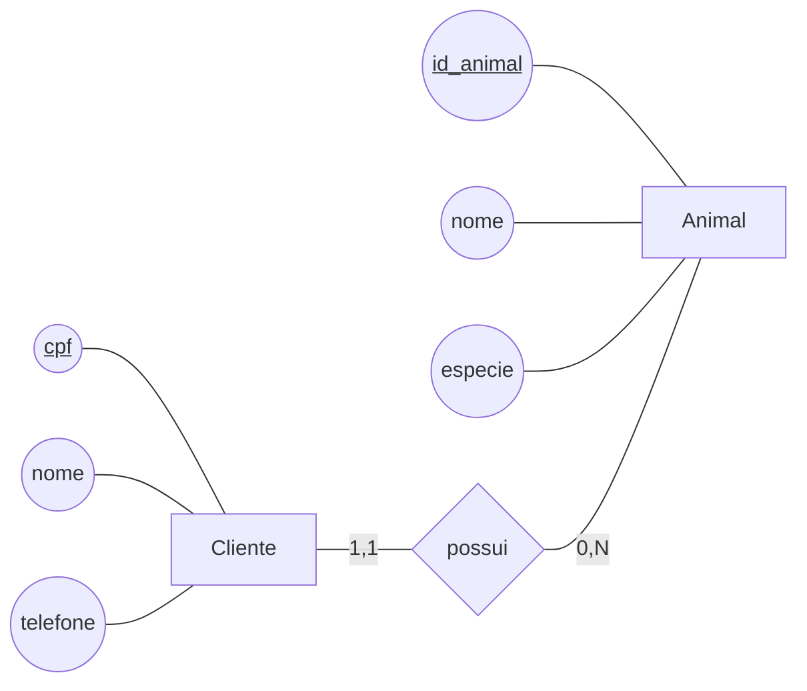
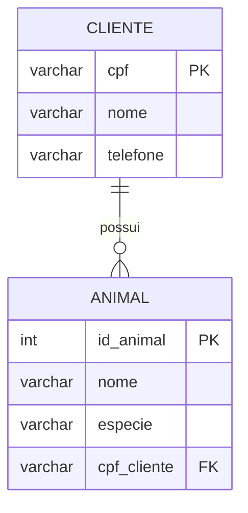

# Dinâmica 1 - Criando nosso primeiro Banco

Nesta aula vamos criar nosso primeiro banco de dados. Vamos começar criando um modelo conceitual a partir de uma descrição de domínio. Depois vamos criar nosso modelo lógico a partir do conceitual. Por fim vamos implementar nosso banco e navegar pelos dados.

## Modelo Conceitual

Neste nível, trabalhamos com o Modelo Entidade-Relacionamento (MER).

- Entidades: representam os objetos ou conceitos do domínio, como cliente e animal de estimação.
- Atributos: são as características das entidades. Neste momento, trabalhamos apenas com atributos simples e monovalorados.
- Atributos identificadores: são atributos que identificam uma instância de uma entidade. Não pode haver duas instâncias da entidade com mesmo valor para este atributo
- Relacionamentos: representam a associação entre entidades.
- Ordem de leitura de um relacionamento: é importante observar a ordem correta da leitura do relacionamento no diagrama.
- Cardinalidades: cada extremidade do relacionamento tem cardinalidade mínima e máxima.
- A cardinalidade mínima é, tipicamente, 0 ou 1.
- A cardinalidade máxima é, tipicamente, 1 ou n.
- A cardinalidade máxima define o tipo do relacionamento:
  - 1:1
  - 1:N
  - N:N

Para ilustrar os conceitos, consideremos o relacionamento entre cliente e animal de estimação. A representação abaixo segue a ideia conceitual da notação do BRModelo, com entidades, atributos e cardinalidades:

Nesse exemplo, um cliente pode possuir zero ou muitos animais, e cada animal pertence a um único cliente. A cardinalidade máxima define o tipo de relacionamento: 1:N.

### Prática de Modelo Conceitual

Para praticar os conceitos vistos até aqui, vamos utilizar a ferramenta BRModelo Offline para criar um modelo conceitual. Para isso faça download da ferramenta e faça as atividades descritas em [atividadeMER1.md](atividadeMER1.md).

## Modelo Lógico

No nível lógico, usamos o modelo relacional, em que tudo é representado como tabelas e colunas. O modelo lógico é derivado diretamente do modelo conceitual:

- Entidades dão origem a tabelas.
- Atributos dão origem a colunas das tabelas.
- Atributos identificadores dão origem às chaves primárias.
- Relacionamentos também devem ser mapeados.
- Nesta aula, trabalharemos com relacionamentos 1:N.
- Em um relacionamento 1:N, a chave primária da tabela do lado 1 é exportada para a tabela do lado N, originando a chave estrangeira.
- A chave estrangeira identifica, em uma tabela, uma linha de outra tabela relacionada.
- Além disso, criamos a restrição de integridade referencial para evitar inconsistência entre chaves primárias e estrangeiras.

Nesse exemplo, a tabela Cliente possui a chave primária `cpf`, enquanto a tabela Animal possui a chave primária `id_animal` e a chave estrangeira `cpf_cliente`, que referencia o cliente ao qual o animal pertence.

### Discussão: inconsistência que a integridade referencial evita

Um exemplo simples é tentar inserir um animal com `cpf_cliente = '999.999.999-99'` na tabela `Animal` quando não existe nenhum cliente com esse CPF na tabela `Cliente`. Nesse caso, o animal estaria apontando para um cliente que não existe, o que geraria inconsistência de dados. Outro exemplo aconteceria se o cliente com `cpf = '111.222.333-44'` fosse excluído da tabela `Cliente`, mas o animal de `id_animal = 25` ainda tivesse `cpf_cliente = '111.222.333-44'` na tabela `Animal`. Nesse cenário, o animal ficaria referenciando um cliente que não existe mais.

A restrição de integridade referencial impede esses problemas: ela garante que, para cada valor de `Animal.cpf_cliente`, exista um registro correspondente em `Cliente.cpf`. Assim, o banco não aceita que um animal seja inserido ou permaneça referenciando um cliente inexistente, preservando a consistência dos dados.

### Discussão: definição de chave primária

As chaves primárias identificam unicamente cada linha de uma tabela. Em um modelo conceitual, nem sempre a entidade possui um atributo identificador já definido no domínio. Quando isso acontece, precisamos criar um atributo identificador no nível lógico para que a tabela tenha uma chave primária.

Por exemplo, em uma entidade `Cliente`, pode não existir um atributo que seja naturalmente adequado para identificar cada cliente no modelo conceitual. Nesse caso, no nível lógico precisamos criar um identificador artificial, como `id_cliente`, para garantir unicidade.

Além disso, é uma boa prática evitar usar atributos de domínio como chave primária, como o CPF, quando a regra de negócio puder mudar. Se o CPF deixar de ser usado ou a sua formação mudar, por exemplo, de 11 dígitos para um formato diferente ou com máscara diferente, isso exigiria alterações na tabela `Cliente` e também em todas as tabelas que armazenam esse valor como chave estrangeira, como `Animal`, `Pedido`, `Pagamento` e outras.

Essa mudança teria impacto muito maior do que usar uma chave artificial, porque a chave artificial pode permanecer estável mesmo que o domínio mude. Assim, embora o CPF seja um identificador natural do cliente, em muitos projetos é preferível criar uma chave primária artificial para reduzir o impacto de alterações no domínio e preservar a estabilidade do banco de dados.

### Prática de Modelo Lógico

Para praticar os conceitos de modelo lógico vistos nesta aula, siga as instruções de [AtividadeModeloLogico1.md](AtividadeModeloLogico1.md).

## Modelo Físico

No nível físico, começamos a pensar no banco como um sistema concreto, em termos de um script SQL e de um esquema implementado em um SGBD. O objetivo desta fase é transformar o modelo lógico em instruções concretas para o SGBD, de forma que o banco possa ser criado e utilizado de fato.

- O modelo físico será representado em forma de script SQL.
- Nesta etapa, vamos trabalhar com a parte de DDL do SQL.
- DDL significa Data Definition Language, ou linguagem de definição de dados.
- A DDL é usada para criar os objetos do banco, como tabelas, colunas, tipos e restrições.
- Em geral, o modelo físico é gerado a partir do modelo lógico.
- Nesta aula vamos gerar o script SQL usando o BRModelo e executá-lo em um banco PostgreSQL hospedado no Aiven, acessado pelo DBeaver.

### Prática de Modelo Físico

Para praticar os conceitos de modelo físico vistos nesta aula, siga as instruções de [atividadeModeloFisico1.md](atividadeModeloFisico1.md).

