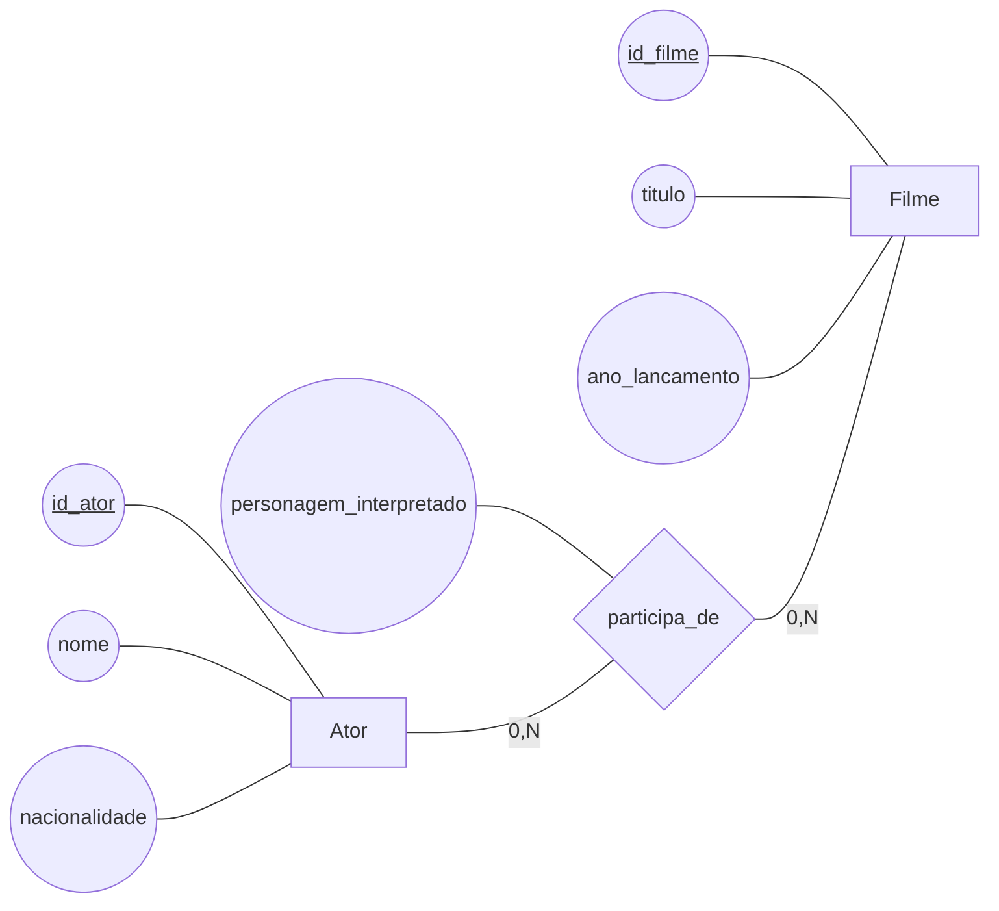
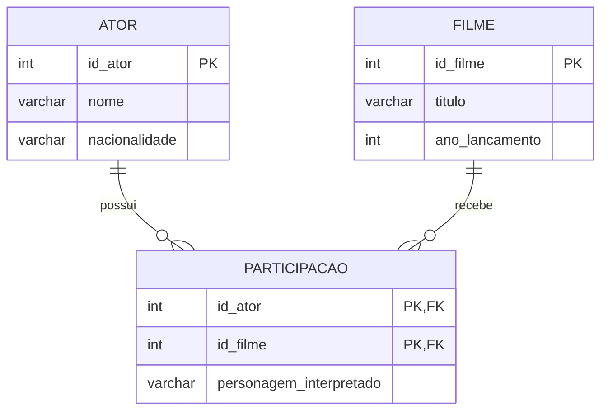

# Aula 2 - Relacionamentos N para N

Nesta aula vamos dar continuidade ao processo de modelagem de banco de dados. Trabalharemos com relacionamentos **N para N**, também escritos como **N:N**, observando como eles são representados nos modelos conceitual, lógico e físico. Ao final, vamos implementar o banco de dados e consultar os registros por meio do PostgreSQL e do DBeaver.

## Modelo Conceitual

No modelo conceitual, descrevemos os conceitos relevantes do domínio e as associações entre eles, sem depender de tabelas, colunas ou comandos SQL. A comunidade de banco de dados tradicionalmente utiliza o Modelo Entidade-Relacionamento (MER) para representar entidades, atributos, relacionamentos e cardinalidades.

Relacionamentos N para N são muito comuns no mundo real. Alguns exemplos são:

- Um aluno pode estar matriculado em várias disciplinas, e uma disciplina pode ter vários alunos.
- Um autor pode escrever várias obras, e uma obra pode ter vários autores.
- Um cliente pode comprar vários produtos, e um produto pode ser comprado por vários clientes.
- Um ator pode participar de vários filmes, e um filme pode ter a participação de vários atores.

Em um relacionamento N:N, cada instância de uma entidade pode se relacionar com várias instâncias da outra entidade, e o mesmo ocorre no sentido contrário. Por isso, nenhuma das duas entidades pode ser considerada simplesmente o lado 1 ou o lado N.

Relacionamentos N:N também podem possuir atributos próprios. Por exemplo:

- O relacionamento entre `Aluno` e `Disciplina` pode ter o atributo `data da matrícula`, `nota final` ou `frequência`.
- O relacionamento entre `Cliente` e `Produto` pode ter o atributo `quantidade comprada` ou `data da compra`.
- O relacionamento entre `Ator` e `Filme` pode ter o atributo `personagem interpretado`.

Esses atributos pertencem à associação específica entre duas instâncias. O personagem interpretado, por exemplo, pode ser diferente para cada combinação de ator e filme; por isso, não pertence exclusivamente ao ator nem exclusivamente ao filme.

Para ilustrar, considere o relacionamento entre atores e filmes. Um ator pode participar de zero ou muitos filmes, e um filme pode contar com zero ou muitos atores. O atributo `personagem_interpretado` descreve cada participação específica. A representação abaixo segue a notação conceitual utilizada no BRModelo:

A leitura do diagrama é: um `Ator` pode participar de zero ou muitos `Filmes`, e um `Filme` pode contar com zero ou muitos `Atores`. O relacionamento é N:N porque há muitos elementos nos dois lados. O atributo `personagem_interpretado` registra uma característica de cada participação específica.

### Prática de Modelo Conceitual

Para praticar os conceitos de relacionamentos N:N, utilize o BRModelo Offline e desenvolva as versões do modelo conceitual descritas em [atividadeMER2.md](AtividadesModeloConceitual/atividadeMER2.md).

## Modelo Lógico

No modelo lógico, representamos os dados como tabelas, colunas, chaves primárias e chaves estrangeiras. Os relacionamentos 1:N podem ser mapeados pela transposição da chave primária do lado 1 para a tabela do lado N. Essa estratégia não é suficiente para relacionamentos N:N.

Para transformar um relacionamento N:N, criamos uma **tabela associativa**. Essa tabela representa o relacionamento e recebe as chaves primárias das duas entidades participantes como chaves estrangeiras. Em geral, essas duas chaves formam uma chave primária composta, que identifica cada combinação entre as entidades.

A tabela associativa transforma o relacionamento N:N em dois relacionamentos 1:N:

1. A tabela `Ator` se relaciona com várias linhas da tabela associativa `Participacao`. Cada linha de `Participacao` corresponde a um ator, e um ator pode aparecer em várias linhas.
2. A tabela `Filme` se relaciona com várias linhas da tabela associativa `Participacao`. Cada linha de `Participacao` corresponde a um filme, e um filme pode aparecer em várias linhas.

Assim, a tabela associativa funciona como um ponto intermediário. Em vez de tentar armazenar diretamente vários atores dentro de uma linha de `Filme` ou vários filmes dentro de uma linha de `Ator`, armazenamos uma linha para cada associação. Por exemplo, se o ator 1 participar dos filmes 101 e 102, serão criadas duas linhas em `Participacao`. Se o filme 101 também tiver o ator 2, será criada outra linha. Cada combinação fica registrada separadamente e pode receber seu próprio `personagem_interpretado`.

O modelo lógico correspondente ao exemplo conceitual é:

Observe que o relacionamento N:N original entre `Ator` e `Filme` foi decomposto em dois relacionamentos 1:N. A tabela `Participacao` possui uma chave estrangeira para `Ator` e outra para `Filme`. Cada ator pode aparecer em várias linhas de `Participacao`, e cada filme também pode aparecer em várias linhas. A combinação `id_ator` e `id_filme` identifica uma participação única e impede o cadastro duplicado da mesma associação.

Essa transformação é necessária porque uma coluna de uma tabela deve armazenar um valor atômico, e não uma lista de chaves estrangeiras. Se colocássemos apenas `id_ator` em `Filme`, cada filme poderia guardar somente um ator nessa coluna. Se colocássemos apenas `id_filme` em `Ator`, cada ator poderia guardar somente um filme. A tabela associativa permite registrar todas as combinações sem repetir grupos de colunas e mantém os atributos da associação no local adequado.

### Discussão: mais de um personagem no mesmo filme

Ao definir `id_ator` e `id_filme` juntos como chave primária da tabela `Participacao`, impedimos que existam dois registros de atuação para o mesmo ator no mesmo filme. Essa regra pode ser adequada quando cada ator interpreta apenas um personagem em cada filme, mas não atende a situações em que um ator interpreta dois ou mais personagens na mesma produção.

Uma solução inadequada seria inserir os dois personagens em um único valor do atributo `personagem_interpretado`, como `Personagem A / Personagem B`. Essa alternativa mistura informações diferentes em uma mesma coluna e dificulta consultas, alterações e a organização dos dados.

Nesse caso, uma solução melhor é criar um identificador próprio para cada atuação, como `id_participacao`, e utilizá-lo como chave primária da tabela `Participacao`. Os atributos `id_ator` e `id_filme` continuam sendo chaves estrangeiras, mas deixam de formar uma chave primária composta. Assim, é possível registrar duas linhas para o mesmo ator e filme, cada uma com um personagem diferente:

| id_participacao | id_ator | id_filme | personagem_interpretado |
|---|---|---|---|
| 1 | 10 | 20 | Personagem A |
| 2 | 10 | 20 | Personagem B |

Essa decisão depende da regra do domínio: a chave composta representa a regra “um ator só pode ter uma atuação por filme”, enquanto `id_participacao` permite várias atuações do mesmo ator no mesmo filme sem armazenar uma lista de personagens em uma única coluna.

### Prática de Modelo Lógico

Para praticar a transformação automatizada do modelo conceitual para o modelo lógico, siga as instruções de [AtividadeModeloLogico2.md](AtividadesModeloLogico/AtividadeModeloLogico2.md). Observe especialmente a tabela associativa gerada para o relacionamento N:N e o tratamento do atributo do relacionamento.

## Modelo Físico

No modelo físico, o modelo lógico é convertido em um script SQL-DDL para criação das tabelas e restrições no SGBD. Nesta aula, utilizaremos o PostgreSQL hospedado no Aiven e acessado pelo DBeaver.

Para mapear o relacionamento N:N no script, serão criadas as tabelas `Ator`, `Filme` e `Participacao`. A tabela `Participacao` terá duas chaves estrangeiras: `id_ator`, referenciando `Ator`, e `id_filme`, referenciando `Filme`. Essas restrições de integridade referencial transformam, no banco, o relacionamento N:N em dois vínculos 1:N: um ator pode ser referenciado por várias participações e um filme pode ser referenciado por várias participações.

A chave primária composta por `id_ator` e `id_filme` evita que a mesma participação seja cadastrada duas vezes. O atributo `personagem_interpretado` fica na tabela associativa porque descreve a relação entre um ator e um filme, e não uma entidade isolada.

**IMPORTANTE**: Note que, conforme discutido na seção sobre modelo lógico, caso seja possível um mesmo ator atuar como dois personagens em um mesmo filme, a estratágia de se definir uma chave primária composta por `id_ator` e `id_filme`não é adequada!!! O script gerado pelo modelo físico segue estritamente as regras definidas pelo modelo lógico!

### Prática de Modelo Físico

Para praticar a criação do script SQL e a implementação do relacionamento N:N no banco, siga as instruções de [atividadeModeloFisico2.md](AtividadesModeloFisico/AtividadeModeloFisico2.md).
