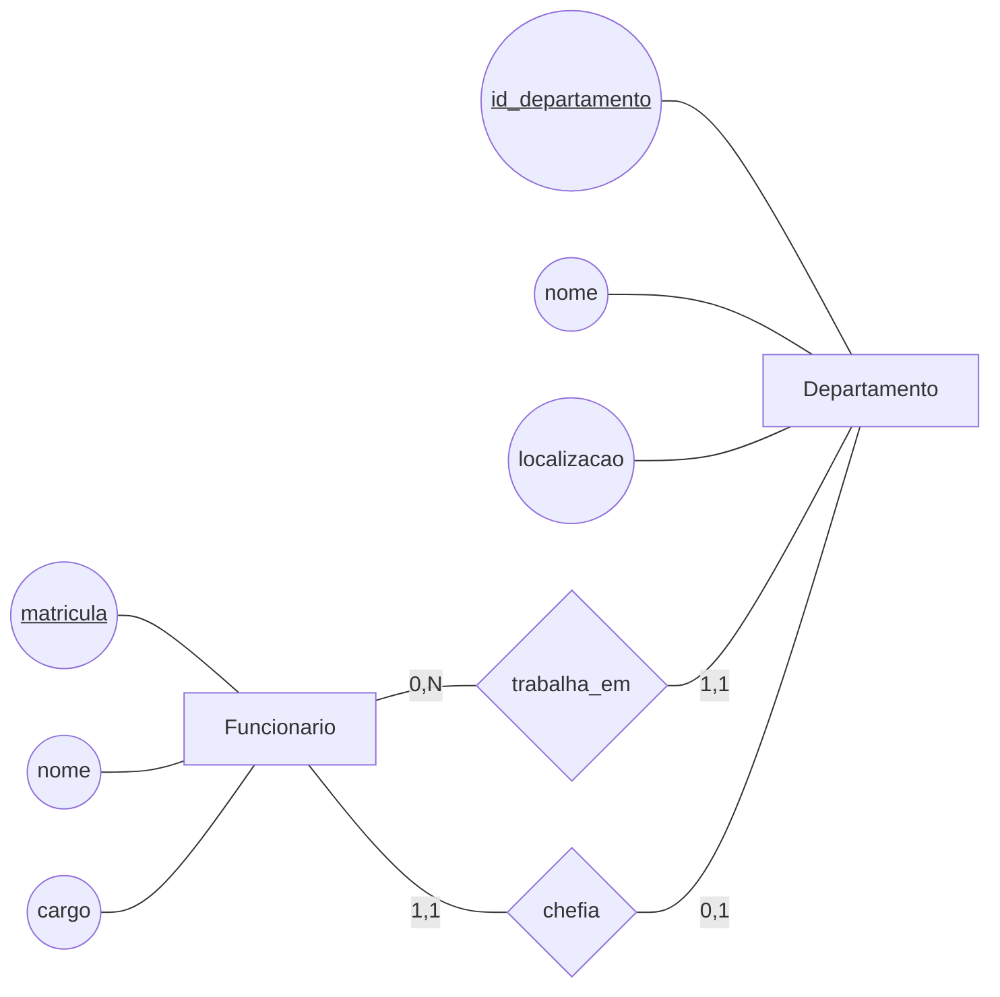
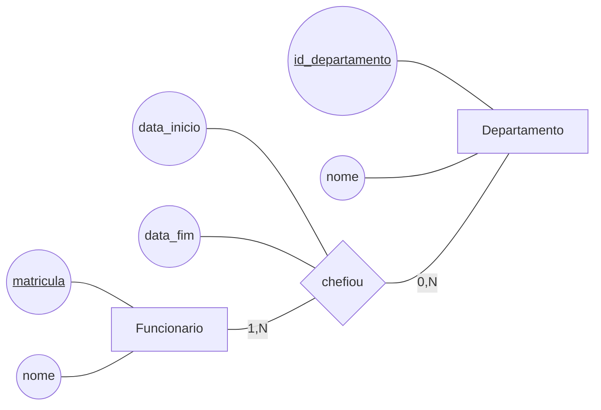
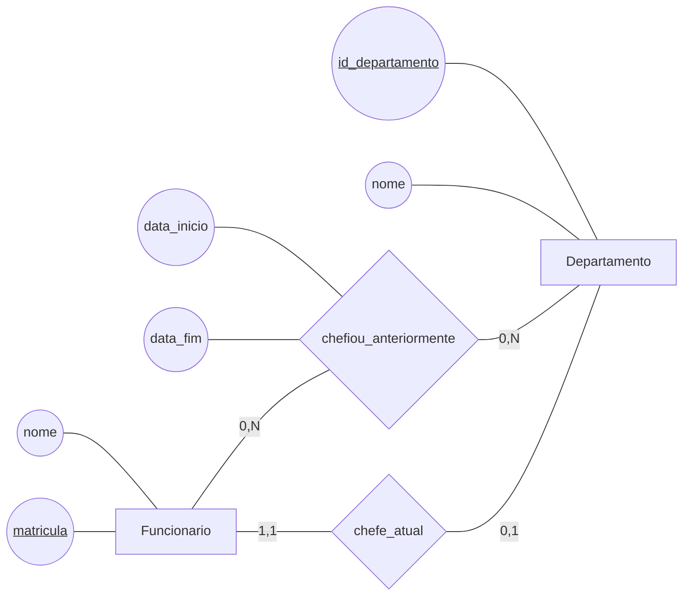
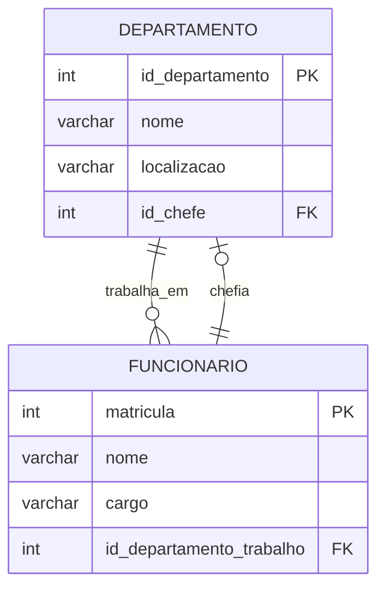

# Aula 3 - Múltiplos Relacionamentos e Dados Históricos

Nesta aula vamos aprofundar a modelagem conceitual a partir de duas situações comuns: a existência de mais de um relacionamento entre as mesmas entidades e a necessidade de armazenar dados históricos. O foco será compreender como as regras do domínio influenciam as entidades, os relacionamentos, as cardinalidades e os atributos de um modelo MER.

## Modelo Conceitual

No modelo conceitual, representamos os conceitos importantes de um domínio e as associações entre eles, sem depender de tabelas, colunas ou comandos SQL. Nesta aula, veremos que duas entidades podem estar ligadas por mais de um relacionamento e que uma regra aparentemente 1:N pode precisar ser representada como N:N quando o sistema deve preservar seu histórico.

### Mais de um relacionamento entre duas entidades

É possível que duas entidades estejam ligadas por mais de um relacionamento. Nesse caso, cada relacionamento representa uma associação diferente e deve ser nomeado de acordo com seu significado no domínio. Não basta desenhar uma única linha entre as entidades, pois isso esconderia regras e informações distintas.

Considere, por exemplo, uma empresa com `Funcionarios` e `Departamentos`:

- Funcionários trabalham em departamentos.
- Funcionários também podem chefiar departamentos.

Essas duas relações envolvem as mesmas entidades, mas não significam a mesma coisa. Trabalhar em um departamento representa a lotação ou alocação do funcionário. Chefiar um departamento representa um papel de liderança. Um funcionário pode trabalhar em um departamento sem ser seu chefe, e um chefe também é um funcionário que trabalha em um departamento.

Outros exemplos de múltiplos relacionamentos entre as mesmas entidades são:

- Em uma universidade, um `Professor` pode lecionar uma `Disciplina` e também coordená-la. São papéis diferentes, mesmo que envolvam as mesmas entidades.
- Em uma editora, um `Autor` pode escrever um `Livro` e também revisar esse livro. Escrever e revisar são relacionamentos distintos, com significados próprios.
- Em um hospital, um `Medico` pode atender um `Paciente` e também acompanhar seu tratamento como responsável. A mesma dupla de entidades pode aparecer em relações diferentes.

A modelagem deve representar claramente essa diferença. Os relacionamentos precisam ter nomes distintos e, quando necessário, atributos próprios. Outra possibilidade é representar explicitamente os papéis desempenhados pelas instâncias, como o papel de chefe, coordenador, revisor ou responsável.

O diagrama abaixo mostra os relacionamentos `trabalha_em` e `chefia` entre `Funcionario` e `Departamento`. A representação segue a notação conceitual utilizada nas dinâmicas anteriores:

No relacionamento `trabalha_em`, cada funcionário trabalha em um departamento e um departamento pode ter vários funcionários. No relacionamento `chefia`, um funcionário pode chefiar nenhum ou um departamento, enquanto cada departamento possui exatamente um chefe (note aqui um exemplo de relação um para um). As cardinalidades e os nomes deixam claro que são duas associações diferentes entre as mesmas entidades.

### Dados atuais e dados históricos

Antes de escolher as entidades e os relacionamentos, é importante perguntar se o sistema precisa conhecer apenas a situação atual ou se também deve preservar o histórico de situações anteriores. Essa decisão altera a forma de representar o domínio.

Em alguns casos, basta armazenar o estado atual:

- Um produto tem um preço de venda atual.
- Um departamento tem um chefe atual.
- Um funcionário está atualmente alocado a um departamento.

Nessas situações, cada alteração substitui o valor anterior. Se o preço mudar de R$ 50,00 para R$ 55,00, o banco pode manter apenas R$ 55,00. Se o chefe do departamento mudar, pode ser suficiente guardar somente quem é o chefe atual.

Em outros casos, o histórico é necessário:

- O sistema deve informar quais foram os preços de venda do produto e em quais períodos cada preço vigorou.
- O sistema deve informar quem chefiou um departamento no passado, quando cada chefia começou e quando terminou.
- O sistema deve permitir consultas como “quem era o chefe em determinada data?” ou “qual era o preço do produto no momento de uma venda?”.

Quando consideramos apenas um ponto do tempo, um departamento tem um chefe atual e podemos representar a chefia como um relacionamento 1:N: cada departamento tem um chefe, e um funcionário pode chefiar vários departamentos. Porém, quando precisamos guardar o histórico, um mesmo departamento pode ter sido chefiado por vários funcionários em períodos diferentes. Da mesma forma, um funcionário pode ter chefiado vários departamentos ao longo do tempo. Nesse caso, a relação passa a ser N:N considerando a dimensão histórica.

O mesmo raciocínio vale para preços. Considerando apenas o preço atual, cada produto possui um preço. Considerando os diversos preços praticados ao longo do tempo, um produto possui vários registros de preço, cada um associado a um período de validade. O relacionamento entre produto e seus registros históricos deixa de representar apenas um valor atual e passa a registrar várias ocorrências.

### Histórico de chefias

Para representar o histórico de chefias, podemos criar um relacionamento N:N entre `Funcionario` e `Departamento`. Esse relacionamento possui os atributos `data_inicio` e `data_fim`, que indicam o período em que determinada pessoa exerceu a chefia. Uma data de fim pode ficar vazia quando a chefia ainda estiver vigente.

A leitura é: um funcionário pode ter chefiado zero ou muitos departamentos, e um departamento pode ter um ou muitos funcionários como chefes ao longo do tempo (no mínimo um pois precisa ter ao menos o chefe atual). Cada ocorrência do relacionamento registra seu próprio intervalo por meio de `data_inicio` e `data_fim`.

Por exemplo, um departamento pode ter sido chefiado por João de 01/01/2024 a 31/03/2024 e por Maria de 01/04/2024 a 30/06/2025 e, desde então é chefiado por Manuel (de 01/07/2025 até os dias atuais, ou seja, data_fim igual a NULL). O histórico preserva as três ocorrências, em vez de apagar a anterior quando a chefia muda.

### Chefia atual e chefias anteriores

Uma alternativa de modelagem é separar explicitamente a chefia atual das chefias anteriores. Nesse caso, criamos dois relacionamentos entre `Funcionario` e `Departamento`:

- `chefe_atual`: relacionamento 1:1 para representar a chefia vigente. Cada departamento possui um chefe atual, e um funcionário pode ser o chefe atual de zero ou um departamento. Como representa somente o estado atual, esse relacionamento não precisa de `data_fim`.
- `chefiou_anteriormente`: relacionamento N:N para representar as chefias encerradas. Um funcionário pode ter chefiado vários departamentos, e um departamento pode ter tido vários chefes anteriores. Esse relacionamento possui `data_inicio` e `data_fim` para registrar cada período encerrado.

O diagrama a seguir mostra os dois relacionamentos entre as mesmas entidades:

No relacionamento `chefe_atual`, cada departamento está ligado a exatamente um funcionário no momento presente. No relacionamento `chefiou_anteriormente`, um departamento pode estar ligado a vários funcionários que o chefiaram em períodos passados, e cada funcionário pode aparecer como antigo chefe de vários departamentos. A separação torna explícita a diferença entre o estado atual e os registros históricos.

Essa solução exige atenção às regras do domínio. Por exemplo, quando um chefe atual é substituído, a ocorrência anterior deve ser registrada no relacionamento histórico e o relacionamento `chefe_atual` deve ser atualizado para apontar para o novo chefe. O modelo conceitual ajuda a tornar essas regras visíveis antes da implementação.

### Prática de Modelo Conceitual

Para praticar os conceitos de múltiplos relacionamentos e dados históricos, utilize o BRModelo Offline e desenvolva as versões do modelo conceitual descritas em [atividadeMER3.md](AtividadesModeloConceitual/atividadeMER3.md).

## Modelo Lógico

No modelo lógico, o fato de existir mais de um relacionamento entre duas entidades não altera as estratégias de mapeamento. Cada relacionamento deve ser analisado e transformado individualmente, de acordo com suas próprias cardinalidades e atributos.

No exemplo entre `Funcionario` e `Departamento`, o relacionamento `trabalha_em` é mapeado separadamente do relacionamento `chefia`. Para `trabalha_em`, a chave primária de `Departamento` é levada para o lado N, na tabela `Funcionario`, originando uma chave estrangeira. Para `chefia`, que é um relacionamento 1:1, é necessário escolher em qual das duas tabelas a chave estrangeira será colocada.

Ao nomear chaves estrangeiras, é recomendável escolher nomes que deixem claro o papel exercido ou o significado da associação. Em vez de utilizar um nome genérico como `id_departamento`, podemos usar `id_departamento_trabalho` para a lotação e `id_departamento_chefiado` para a chefia. Da mesma forma, uma chave que referencia o funcionário responsável pode ser chamada de `id_chefe`, tornando explícito o papel desempenhado por esse funcionário.

### Mapeamento de relacionamentos 1:1

No relacionamento `chefia` do exemplo, cada `Departamento` tem exatamente um chefe atual, enquanto um `Funcionario` pode ser chefe atual de zero ou um departamento. Portanto, trata-se de um relacionamento 1:1. Diferentemente de um relacionamento 1:N, não existe um único lado N que determine automaticamente onde a chave estrangeira deve ser colocada. Nesse caso, podemos escolher levar a chave de uma entidade para a outra.

Uma possibilidade seria levar `matricula` de `Funcionario` para `Departamento`, criando o atributo `id_chefe`. Outra possibilidade seria levar `id_departamento` de `Departamento` para `Funcionario`, criando um atributo que identificasse o departamento chefiado. As duas alternativas podem representar a associação, desde que as restrições adequadas sejam definidas para garantir a cardinalidade 1:1.

Neste exemplo, a opção escolhida é levar a chave do funcionário para `Departamento`, criando `id_chefe` como chave estrangeira. A escolha se justifica porque todo departamento deve ter um chefe, portanto `id_chefe` pode ser um atributo obrigatório, enquanto um funcionário pode chefiar zero departamentos. A ideia geral é levar a chave estrangeira para o lado em que ela possa se tornar um atributo mandatório, evitando valores ausentes para uma participação que é obrigatória.

O modelo lógico parcial pode ser representado assim:

No diagrama, `id_departamento_trabalho` representa o relacionamento `trabalha_em`, enquanto `id_chefe` representa o relacionamento `chefia`. O atributo `id_chefe` deve ser obrigatório no esquema físico, pois cada departamento precisa ter um chefe. Além disso, uma restrição de unicidade sobre `id_chefe` pode ser necessária para garantir que um funcionário não seja chefe atual de mais de um departamento, conforme a regra 1:1 do domínio.

### Prática de Modelo Lógico

Para praticar o mapeamento de múltiplos relacionamentos e do relacionamento 1:1, siga as instruções de [AtividadeModeloLogico3.md](AtividadesModeloLogico/AtividadeModeloLogico3.md).

## Modelo Físico

No modelo físico, o modelo lógico será transformado em um script SQL-DDL para criação das tabelas e restrições no PostgreSQL hospedado no Aiven. Nesta aula, o foco será observar como os múltiplos relacionamentos e os dados históricos aparecem no script.

Os relacionamentos entre `Funcionario` e `Projeto` devem ser implementados separadamente. Cada tabela associativa terá suas próprias chaves estrangeiras e atributos, como `data_inicio`, `data_fim` e `funcao_colaborador`. Assim, o banco mantém distintas as associações de coordenação e colaboração e permite registrar seus períodos históricos.

### Prática de Modelo Físico

Para gerar e executar o script SQL do modelo lógico, siga as instruções de [atividadeModeloFisico3.md](AtividadesModeloFisico/atividadeModeloFisico3.md).
