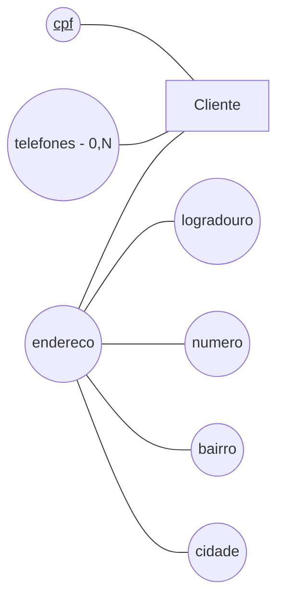
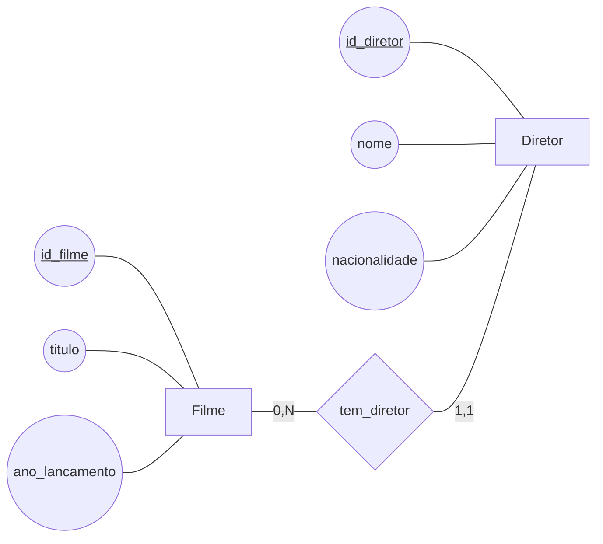
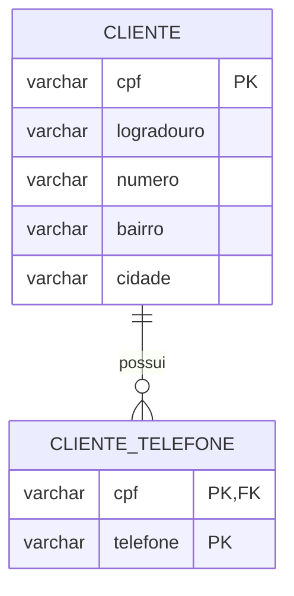

# Aula 4 - Atributos Multivalorados e Compostos

Nesta aula vamos aprofundar a definição de atributos no modelo conceitual. Até aqui, todos os atributos definidos nas dinâmicas tinham apenas um valor para cada indivíduo, ou seja, eram **monovalorados**, e não eram estruturados em partes, ou seja, eram **atômicos**.

## Modelo Conceitual

No modelo conceitual, os atributos representam características das entidades. Além de atributos monovalorados e atômicos, um domínio pode possuir atributos que armazenam vários valores ou que são formados por partes menores. É importante identificar essas características para representar corretamente as informações do domínio.

### Atributos monovalorados ou multivalorados

Um atributo é **monovalorado** quando cada ocorrência de uma entidade possui apenas um valor para esse atributo. Por exemplo, cada funcionário pode ter uma única data de nascimento e cada livro pode ter um único ISBN. Até aqui, trabalhamos somente com atributos monovalorados: cada atributo definido nas dinâmicas anteriores tinha um único valor para cada indivíduo.

Um atributo é **multivalorado** quando uma mesma ocorrência de uma entidade pode possuir vários valores para esse atributo.

Por exemplo, uma pessoa pode ter mais de um telefone, um aluno pode possuir vários endereços de e-mail, um funcionário pode dominar vários idiomas e um livro pode ter várias palavras-chave. Nesses casos, cada indivíduo pode ter mais de um valor para o atributo:

- Um `Cliente` pode ter os telefones `11999990000` e `1133334444`.
- Um `Funcionario` pode falar `português`, `inglês` e `espanhol`.
- Um `Livro` pode possuir as palavras-chave `banco de dados`, `SQL` e `modelagem`.

Um atributo multivalorado possui uma cardinalidade mínima e uma cardinalidade máxima. A cardinalidade mínima indica se o atributo pode ou não ficar vazio, enquanto a cardinalidade máxima indica a quantidade máxima de valores que ele pode possuir. Quando não há uma quantidade máxima definida, a cardinalidade máxima é `N`. No BRModelo, essas cardinalidades podem ser configuradas nas propriedades do atributo. No modelo ER, as cardinalidades do atributo multivalorado são exibidas na frente do nome do atributo.

### Atributos simples ou compostos

Um atributo é **simples** quando não pode ser dividido em partes menores com significado próprio. Até o momento, trabalhamos somente com atributos simples, como `nome`, `telefone`, `nacionalidade` e `ISBN`, considerados como valores únicos e indivisíveis no contexto do modelo.

Um atributo é **composto** quando pode ser dividido em partes menores, que possuem significado próprio. O atributo completo representa uma informação, mas suas partes também podem ser utilizadas individualmente.

São exemplos de atributos compostos:

- `Nome`, formado por `nome` e `sobrenome`.
- `Endereço`, formado por `logradouro`, `numero`, `complemento`, `bairro`, `cidade`, `estado` e `cep`.
- `Telefone`, formado por `ddd` e `numero`.
- `Data`, formada por `dia`, `mes` e `ano`.

Por exemplo, o endereço de um `Cliente` pode ser representado como um único atributo composto, formado por `logradouro`, `numero`, `bairro`, `cidade` e `cep`. Essa estrutura permite compreender que todas essas partes formam um endereço e que um endereço é obrigatoriamente formado por essas partes. Também permite utilizar cada parte separadamente em consultas ou regras do domínio.
### Exemplo de atributos multivalorado e composto

O diagrama abaixo representa uma entidade `Cliente` com o atributo identificador `cpf`, o atributo multivalorado `telefones` e o atributo composto `endereco`. A cardinalidade `(0,N)` aparece antes do nome do atributo multivalorado, indicando que um cliente pode não ter telefone ou ter vários telefones.

Nesse exemplo, `cpf` é um atributo simples, monovalorado que identifica unicamente cada cliente. `telefones` é multivalorado porque pode possuir de zero a vários valores. `endereco` é composto porque é formado pelos atributos `logradouro`, `numero`, `bairro` e `cidade`.

### Discussão: entidade ou atributo composto?

O fato de um conceito poder ser dividido em atributos de menor granularidade não é suficiente para decidir se ele deve ser modelado como um atributo composto ou como uma entidade. Tanto um atributo composto quanto uma entidade podem ser definidos por partes menores, mas a decisão deve considerar principalmente a **independência existencial** e a **importância do conceito dentro do contexto**.

Um conceito tem independência existencial quando pode existir e ser compreendido independentemente de outro conceito. Também é importante observar se ele tem uma “vida própria” no domínio e se pode ser relevante para outras relações, consultas e análises. Quando o conceito só faz sentido como parte de uma entidade e não nos interessa acompanhá-lo separadamente, o mais natural é representá-lo como um atributo, que pode ser simples ou composto.

Por exemplo, no cadastro de clientes, o `endereco` é uma informação intrínseca de um `Cliente`, assim como o `nome`. Não nos interessa manter um endereço independente da existência do cliente, nem estabelecer relacionamentos entre endereços e outras entidades. Embora o endereço possa ser dividido em `logradouro`, `numero`, `bairro`, `cidade` e `cep`, ele não tem “vida própria” nesse contexto. Portanto, o mais adequado é modelá-lo como um atributo composto, como fizemos no modelo anterior.

Por outro lado, considere que um contexto em que um `Filme` tem um `Diretor`, e que o diretor possui atributos como `nome` e `nacionalidade`. O `Diretor` é um indivíduo que existe independentemente de um filme específico: ele pode dirigir vários filmes, pode ser consultado mesmo quando não há um filme selecionado e pode participar de análises como quantidade de filmes dirigidos ou nacionalidade dos diretores. Nesse contexto, o diretor tem importância própria e deve ser modelado como uma entidade, ligada a `Filme` por um relacionamento.

Nesse segundo modelo, cada `Filme` possui exatamente um `Diretor`, enquanto um `Diretor` pode estar associado a nenhum ou a vários `Filmes`. A diferença entre os dois modelos não está apenas na quantidade de atributos de menor granularidade: ela está no papel que o conceito desempenha no domínio. O endereço depende do cliente e é uma característica dele; o diretor existe independentemente do filme e participa de várias possíveis análises e associações. Não seria adequado, no segundo domínio, modelar diretor como um atributo composto de Filme.

## Modelo Lógico

No modelo lógico, representamos os dados como tabelas, colunas, chaves primárias e chaves estrangeiras. A transformação de atributos compostos e multivalorados segue regras diferentes:

- Os atributos simples dão origem a colunas.
- Um atributo composto não dá origem a uma coluna para o atributo completo. Suas partes dão origem a colunas da tabela da entidade.
- Um atributo multivalorado dá origem a uma tabela própria, que armazena cada valor em uma linha e possui uma chave estrangeira para a entidade que possui o atributo.

Considere novamente o exemplo conceitual de `Cliente`, que possui o atributo composto `endereco` e o atributo multivalorado `telefones`. Como `endereco` é um atributo composto, suas partes são incorporadas à tabela `Cliente`. Não criamos uma coluna chamada `endereco`, pois cada coluna deve armazenar um valor atômico:

O atributo multivalorado `telefones` é transformado na tabela `Cliente_Telefone`. Cada telefone de um cliente ocupa uma linha própria. O atributo `cpf` é, ao mesmo tempo, chave estrangeira para `Cliente` e parte da chave primária composta da nova tabela; `telefone` completa essa chave e impede o cadastro repetido do mesmo telefone para o mesmo cliente. Assim, o cliente pode ter zero ou vários telefones sem armazenar uma lista de valores em uma única coluna.

### Prática de Modelo Lógico

Para praticar a transformação automática de atributos compostos e multivalorados para o modelo lógico, siga as instruções da [AtividadeModeloLogico4.md](AtividadesModeloLogico/AtividadeModeloLogico4.md).

## Modelo Físico

No modelo físico, o modelo lógico será transformado em um script SQL-DDL para criação das tabelas e restrições no PostgreSQL hospedado no Aiven. Nesta aula, o foco será observar como os atributos compostos e multivalorados aparecem no banco.

As partes do atributo composto `endereco` serão implementadas como colunas nas tabelas das entidades. Já o atributo multivalorado `telefones` será implementado em tabelas próprias, com chaves estrangeiras para `Cliente` ou `Vendedor`. O preço atual de `Produto` e o `preco_vendido` de cada venda também serão armazenados separadamente, preservando os dados históricos.

### Prática de Modelo Físico

Para gerar e executar o script SQL do modelo lógico e inserir os clientes no banco, siga as instruções da [AtividadeModeloFisico4.md](AtividadesModeloFisico/AtividadeModeloFisico4.md).
