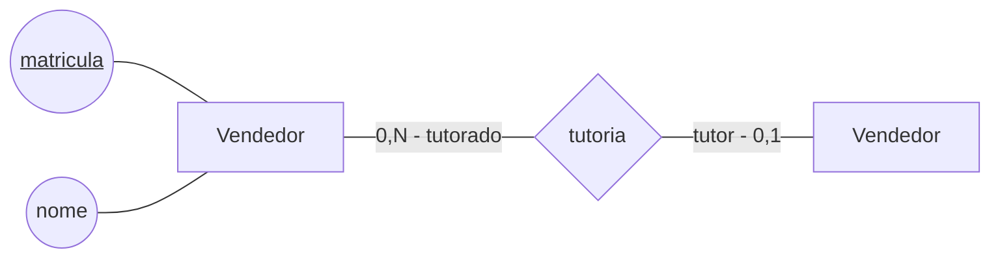
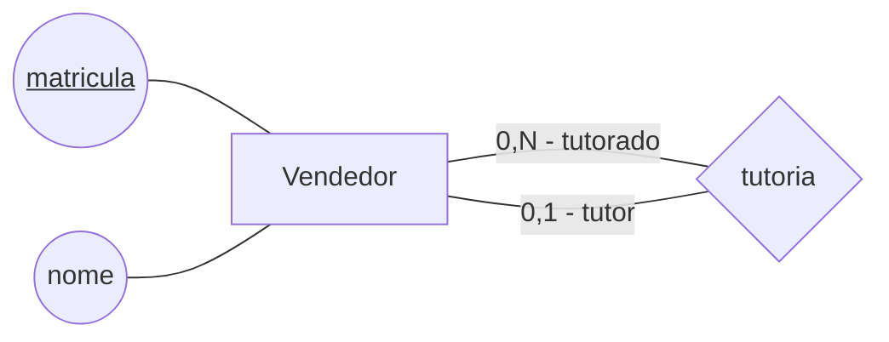
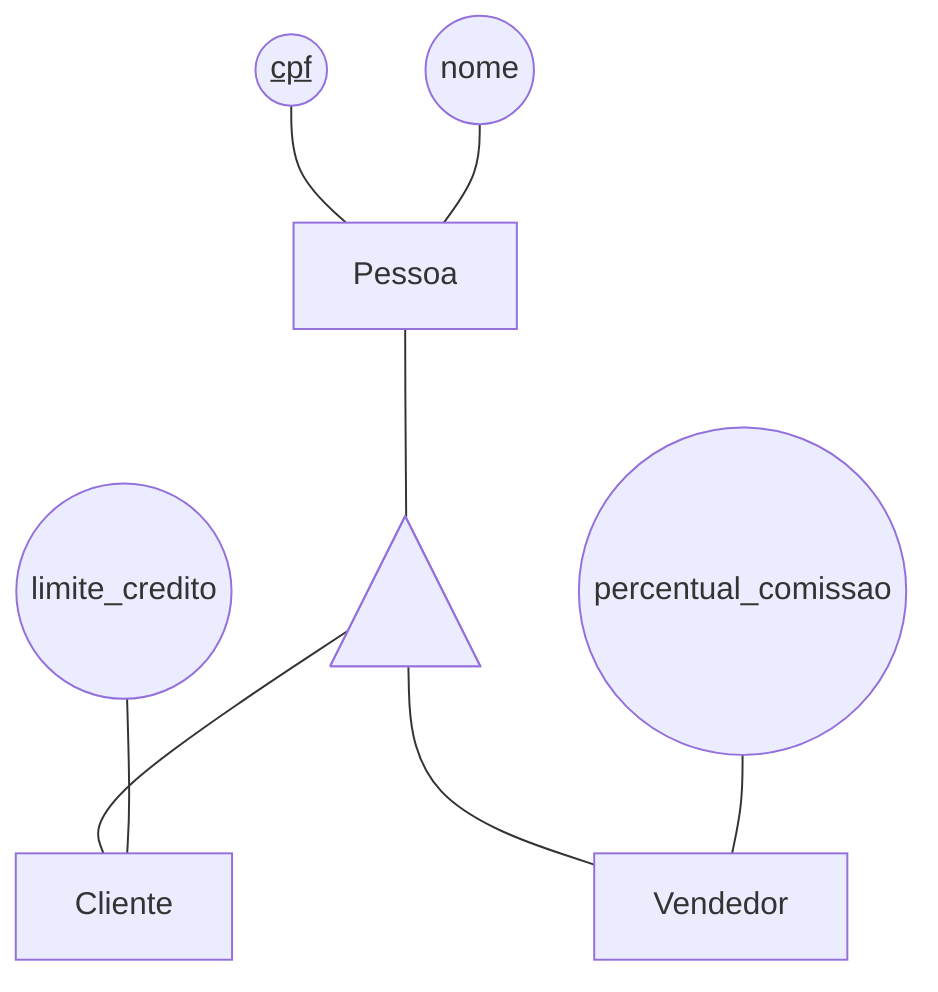
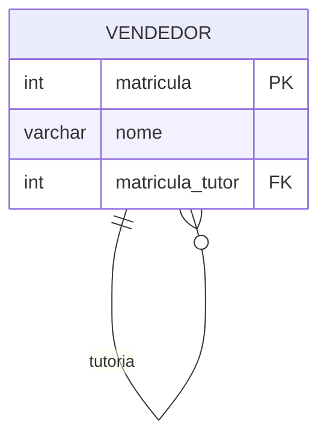
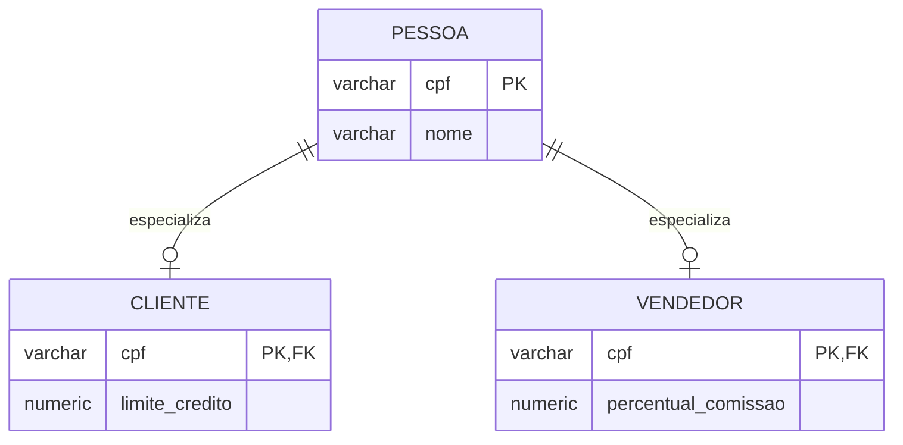
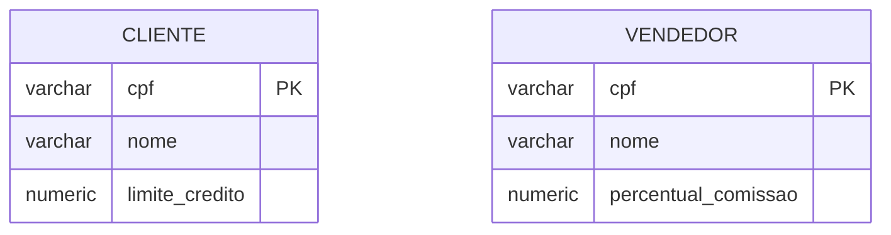
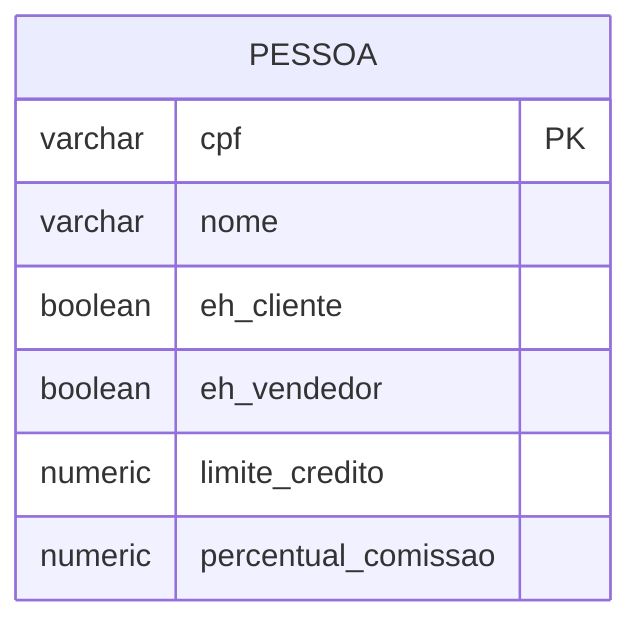

# Aula 5 - Heranças e Autorrelacionamentos

## Modelo Conceitual

Nesta aula, vamos estudar duas situações importantes da modelagem conceitual: a herança entre entidades e os autorrelacionamentos. Em ambos os casos, é necessário observar com cuidado quais conceitos existem no domínio, quais características eles compartilham e como as instâncias podem se relacionar.

### Autorrelacionamentos

Um **autorrelacionamento** é um relacionamento em que os indivíduos relacionados são instâncias da mesma entidade. Portanto, as duas extremidades do relacionamento são conectadas à mesma entidade. O fato de a entidade aparecer nos dois lados não significa que existam duas entidades diferentes: são dois papéis desempenhados por instâncias da mesma entidade.

Considere o cenário em que os vendedores da loja podem ter um vendedor tutor. O tutor é um vendedor mais experiente, responsável por dar apoio a outro vendedor. Um vendedor pode ter nenhum ou um tutor, enquanto um vendedor pode ser tutor de zero ou vários outros vendedores.

O relacionamento `tutoria` ocorre entre dois vendedores. Por isso, as duas extremidades estão conectadas à entidade `Vendedor`. Os papéis ajudam a distinguir a função de cada participante: em uma extremidade está o `tutor`, e na outra está o `tutorado`.

O primeiro diagrama usa duas representações de `Vendedor` apenas como um recurso didático para facilitar a visualização das duas extremidades e dos papéis. As duas caixas não representam entidades diferentes: ambas representam a mesma entidade `Vendedor`.

De acordo com a notação de autorrelacionamento, o correto é conectar as duas extremidades do relacionamento à mesma representação da entidade `Vendedor`, como no diagrama abaixo:

Nesse segundo diagrama, `Vendedor` aparece uma única vez e está conectado às duas extremidades de `tutoria`. A leitura é: um `tutor` pode acompanhar zero ou vários `tutorados`, e um `tutorado` pode ter zero ou um `tutor`.

Nomear os papéis pode ser útil em qualquer relacionamento, pois torna sua semântica mais clara. Em um autorrelacionamento, esse recurso é especialmente importante: sem os papéis `tutor` e `tutorado`, seria difícil distinguir qual vendedor oferece apoio e qual vendedor recebe apoio.

### Heranças

Na modelagem conceitual, usamos **herança** quando uma entidade mais específica possui as características de uma entidade mais geral e, além disso, possui características próprias. A entidade geral é chamada de **entidade pai** ou **superentidade**, e as entidades específicas são chamadas de **entidades filhas** ou **subentidades**.

Uma instância de uma entidade filha também é uma instância da entidade pai. Em termos de conjuntos, o conjunto de instâncias de cada entidade filha é um subconjunto do conjunto de instâncias da entidade pai:

`Instancias(Cliente) ⊆ Instancias(Pessoa)`

`Instancias(Vendedor) ⊆ Instancias(Pessoa)`

No contexto da loja estudada na dinâmica anterior, `Cliente` e `Vendedor` são papéis que podem ser exercidos por pessoas. Por isso, podemos criar a entidade `Pessoa` para agrupar os atributos comuns a todas as pessoas, como `cpf` e `nome`. Notem que, conceitualmente, os indivíduos tem `cpf` e `nome`, não por serem vendedores ou clientes, mas por serem pessoas. Ao acrescentar ao nosso modelo a entidade `Pessoa` apenas estamos refletindo esse aspecto do domínio. As entidades `Cliente` e `Vendedor` herdam esses atributos e recebem também os atributos específicos de cada papel.

Por exemplo, `limite_credito` pode ser um atributo específico de `Cliente`, enquanto `percentual_comissao` pode ser específico de `Vendedor`. Não é necessário repetir `cpf` e `nome` nas entidades filhas, pois esses atributos já pertencem a `Pessoa` e são herdados por elas.

O triângulo representa a generalização/especialização do modelo Entidade-Relacionamento Estendido. A linha que sai da ponta superior do triângulo é ligada à entidade pai e as que saem da base do triângulo indicam as entidades filhas. Nesse exemplo um `Cliente` é uma `Pessoa` e um `Vendedor` também é uma `Pessoa`. Assim, toda instância de `Cliente` possui `cpf` e `nome`, além de `limite_credito`; toda instância de `Vendedor` possui `cpf` e `nome`, além de `percentual_comissao`.

Essa especialização não significa necessariamente que toda pessoa seja cliente ou vendedor. Podem existir pessoas que não exerçam nenhum desses papéis. Também é possível que a mesma pessoa seja, ao mesmo tempo, cliente e vendedor, pois os conjuntos de instâncias de `Cliente` e `Vendedor` podem ter elementos em comum. Em casos em que a mesma pessoa exerçam ambos os papeis, as informações básicas dela, como `cpf` e `nome` não serão duplicados como seriam caso modelássemos apenas as entidades `Cliente` e `Vendedor`.

### Prática de Modelo Conceitual

Para praticar os conceitos de herança e autorrelacionamentos, siga as instruções da [atividadeMER5.md](AtividadesModeloConceitual/atividadeMER5.md).

## Modelo Lógico

### Autorelacionamentos
No modelo lógico, os autorrelacionamentos seguem as mesmas regras de transformação dos relacionamentos entre entidades diferentes. A estratégia depende das cardinalidades:

- Em um relacionamento 1:N, a chave primária do lado 1 é transposta como chave estrangeira para a tabela do lado N.
- Em um relacionamento N:N, é criada uma tabela associativa com duas chaves estrangeiras, uma para cada extremidade do relacionamento.

A diferença é que, no autorrelacionamento, a tabela que fornece a chave primária é a mesma tabela que recebe a chave estrangeira. As duas referências apontam para a mesma tabela, mas devem ser nomeadas de acordo com os papéis desempenhados na relação.

No exemplo da `tutoria`, temos um autorrelacionamento 1:N: um vendedor pode ser tutor de zero ou vários vendedores, enquanto um vendedor pode ter zero ou um tutor. Por isso, a chave primária `matricula` do papel `tutor` é transposta para a própria tabela `Vendedor`, formando a chave estrangeira `matricula_tutor`, associada ao papel `tutorado`.

Nesse modelo, `matricula_tutor` referencia `Vendedor.matricula`. Um valor vazio indica que o vendedor ainda não possui tutor, e um valor preenchido identifica o vendedor responsável por tutoreá-lo. A mesma tabela, portanto, armazena tanto os tutores quanto os tutorados.

Se a tutoria fosse N:N, a transposição direta não seria suficiente. Nesse caso, seria criada uma tabela associativa, como `Tutoria`, contendo duas chaves estrangeiras para `Vendedor`: uma para o papel `tutor` e outra para o papel `tutorado`. A regra é a mesma de qualquer relacionamento N:N; apenas as duas chaves estrangeiras referenciam a mesma tabela.

### Heranças

O modelo relacional não possui o conceito de herança. Nesse modelo, existem apenas tabelas e colunas, além de chaves primárias e chaves estrangeiras. Por isso, uma hierarquia de herança precisa ser transformada em uma estrutura de tabelas que preserve os atributos comuns, os atributos específicos e as regras de identificação das instâncias.

Existem três abordagens principais para realizar esse mapeamento:

1. uma tabela para cada entidade;
2. uma tabela para cada entidade filha;
3. uma tabela para toda a hierarquia.

Considere a hierarquia apresentada no modelo conceitual: `Pessoa` possui os atributos `cpf` e `nome`; `Cliente` possui o atributo específico `limite_credito`; e `Vendedor` possui o atributo específico `percentual_comissao`.

#### Abordagem 1: Uma tabela para cada entidade

Nesta abordagem, criamos uma tabela para a entidade pai e uma tabela para cada entidade filha. A chave primária da tabela pai é repetida nas tabelas filhas, onde também funciona como chave estrangeira:

Para cadastrar um `Cliente`, primeiro é necessário inserir a pessoa na tabela `Pessoa` e depois seu registro na tabela `Cliente`. Essa abordagem é mais adequada quando os atributos comuns são importantes e numerosos, quando existem muitas entidades filhas ou quando se deseja evitar a duplicação de dados. Ela mantém o modelo mais normalizado, mas pode exigir junções para recuperar os dados completos de uma instância filha.
Pensando em consistência de dados, esta costuma ser a estratégia mais recomendada.

#### Abordagem 2: Uma tabela para cada entidade filha

Nesta abordagem, não criamos uma tabela para a entidade pai. Cada entidade filha recebe os atributos herdados e os seus atributos específicos:

Nesse caso, uma pessoa que seja simultaneamente `Cliente` e `Vendedor` aparecerá nas duas tabelas, e os valores de `cpf` e `nome` serão armazenados duas vezes. Também não há uma tabela para cadastrar uma `Pessoa` que não exerça nenhum desses papéis. A abordagem é mais adequada quando toda instância da entidade pai pertence a alguma entidade filha, quando há poucas filhas e quando se deseja consultar cada tipo diretamente, sem junções. Ela é menos indicada quando pode haver sobreposição entre as filhas ou quando os dados comuns são frequentemente alterados.

#### Aboradagem 3: Uma tabela para toda a hierarquia

Nesta abordagem, criamos uma única tabela para a entidade pai e colocamos nela os atributos comuns e os atributos específicos das entidades filhas. Como uma mesma pessoa pode ser cliente e vendedor, as colunas `eh_cliente` e `eh_vendedor` indicam quais papéis a pessoa exerce:

Uma pessoa que não seja cliente nem vendedor terá os dois indicadores como falsos; uma pessoa que exerça os dois papéis terá ambos como verdadeiros. Os atributos específicos podem ficar vazios quando o papel correspondente não for exercido. Essa abordagem é mais adequada quando a hierarquia é simples, possui poucas entidades filhas, quando as consultas costumam envolver toda a hierarquia e quando se deseja evitar junções. Em contrapartida, pode gerar muitas colunas vazias e exige restrições adicionais para garantir que cada atributo específico seja preenchido apenas quando o papel correspondente estiver ativo.
De forma geral, é a estratégia menos recomendada.

### Prática de Modelo Lógico

Para praticar a transformação automática da herança e do autorrelacionamento para o modelo lógico, siga as instruções da [AtividadeModeloLogico5.md](AtividadesModeloLogico/AtividadeModeloLogico5.md).

## Modelo Físico

No modelo físico, os comandos SQL para criar as tabelas que mapeiam a herança são rigorosamente iguais aos comandos usados para criar qualquer outra tabela. Como o modelo relacional não possui o conceito de herança, ela é implementada por meio de tabelas, colunas e transposições de chaves.

No autorrelacionamento de `Vendedor`, será criada uma restrição de integridade referencial em que a própria tabela possui a chave primária `matricula` e a chave estrangeira `matricula_tutor`, que referencia `Vendedor.matricula`.

### Prática de Modelo Físico

Para gerar e executar o script SQL e inserir registros de clientes e vendedores no banco, siga as instruções da [AtividadeModeloFisico5.md](AtividadesModeloFisico/AtividadeModeloFisico5.md).
